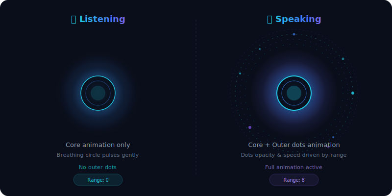

# AI Animation Player

A React-based Lottie animation player with **AI listening/speaking states** and **frequency-range controlled visuals**. Built with Next.js 12 and `lottie-react`.

## Preview

<p align="center">
  
</p>

> **Left: Listening** — Only the core center animation plays with a gentle breathing glow. No outer dots.
>
> **Right: Speaking** — Full animation with outer dotted rings orbiting the core. Intensity controlled by frequency range (0–10).

---

## How the Animation Works

The animation is powered by a single Lottie JSON file (`Combined_UI 3.json`) that is **split at runtime** into two separate layers:

### Layer Architecture

```
┌──────────────────────────────────────┐
│           Full Animation             │
│                                      │
│   ┌──────────────────────────────┐   │
│   │     Outer Dots Layer         │   │  ← "audio dots" (dotted ring circles)
│   │     (Speaking only)          │   │     Controlled by frequency range 0–10
│   │                              │   │
│   │   ┌──────────────────────┐   │   │
│   │   │   Core Animation     │   │   │  ← Center bubbles, gradients, shapes
│   │   │   (Always visible)   │   │   │     Visible in BOTH states
│   │   │                      │   │   │
│   │   │   ┌──────────────┐   │   │   │
│   │   │   │  Breathing   │   │   │   │  ← CSS circle with scale animation
│   │   │   │   Circle     │   │   │   │     Scale driven by range value
│   │   │   └──────────────┘   │   │   │
│   │   └──────────────────────┘   │   │
│   └──────────────────────────────┘   │
└──────────────────────────────────────┘
```

### AI States

| State         | Core Animation | Outer Dots          | Breathing Circle     |
| ------------- | -------------- | ------------------- | -------------------- |
| **Listening** | ✅ Visible     | ❌ Hidden           | ✅ Slow pulse (3s)   |
| **Speaking**  | ✅ Visible     | ✅ Range-controlled | ✅ Fast pulse (1.5s) |

### Frequency Range (0–10)

The range slider controls the intensity of the animation during **Speaking** mode:

| Range  | Dots Opacity | Dots Scale | Lottie Speed | Breath Scale |
| ------ | ------------ | ---------- | ------------ | ------------ |
| **0**  | 0% (hidden)  | 0.6x       | 0.3x         | 1.0x         |
| **5**  | 50%          | 0.8x       | 1.15x        | 1.25x        |
| **10** | 100% (full)  | 1.0x       | 2.0x         | 1.5x         |

---

## How We Handle the Animation

### Runtime Layer Splitting

Instead of maintaining separate JSON files, we split the Lottie data at runtime using `useMemo`:

```jsx
// Core animation — filters OUT the "audio dots" layer
const coreAnimationData = useMemo(
  () => ({
    ...animationData,
    layers: animationData.layers.filter((l) => l.nm !== "audio dots"),
  }),
  [],
);

// Dots animation — filters to ONLY the "audio dots" layer
const dotsAnimationData = useMemo(
  () => ({
    ...animationData,
    layers: animationData.layers.filter((l) => l.nm === "audio dots"),
  }),
  [],
);
```

### Two Lottie Instances

- **Core Lottie** — Always rendered, plays continuously in both states
- **Dots Lottie** — Rendered with dynamic `opacity` and `transform: scale()` driven by the range slider. Hidden during Listening mode.

### CSS Breathing Circle

A CSS-only animated circle sits behind the Lottie layers. Its scale is controlled by a CSS custom property `--breath-scale` set from React state:

```css
@keyframes breathe {
  0%,
  100% {
    transform: scale(1);
  }
  50% {
    transform: scale(var(--breath-scale, 1.3));
  }
}
```

---

## Integration Guide

To use this animation as a component in your project:

```jsx
// Set the AI state programmatically
const [aiState, setAiState] = useState("listening");
const [breathRange, setBreathRange] = useState(0);

// When AI starts speaking:
setAiState("speaking");
setBreathRange(7); // Set based on audio amplitude/frequency

// When AI starts listening:
setAiState("listening");
setBreathRange(0);
```

The `breathRange` (0–10) can be driven by real-time audio amplitude data to create a reactive voice visualization.

---

## Getting Started

### Prerequisites

- **Node.js** v16 or higher — [Download here](https://nodejs.org/)
- **npm** (comes with Node.js)
- **Git** — [Download here](https://git-scm.com/)

### Step 1: Clone the Repository

```bash
git clone git@github.com:krishana7773/Ai-animation.git
cd Ai-animation
```

### Step 2: Install Dependencies

```bash
npm install
```

This installs `next`, `react`, `react-dom`, and `lottie-react`.

### Step 3: Run the Development Server

```bash
npm run dev
```

The server starts on **port 3005**. Open your browser and go to:

👉 **[http://localhost:3005](http://localhost:3005)**

You should see:

- A dark-themed page with the **"AI Animation"** title
- A glowing **breathing circle** in the center (Listening mode)
- **Listening / Speaking** toggle buttons
- A **Frequency Range** slider (0–10)

### Step 4: Try It Out

1. The default state is **Listening** — only the core animation + breathing circle are visible
2. Click **"Speaking"** — the full Lottie animation appears with outer dotted rings
3. Drag the **Frequency Range** slider to the right — the outer dots become more visible, scale up, and the animation speeds up
4. Click **"Listening"** again — the outer dots fade away, returning to the calm center animation

### Production Build

```bash
npm run build
npm start
```

This creates an optimized production build and starts the server.

---

## Project Structure

```
lottie-player/
├── pages/
│   ├── index.js          # Main page with AI animation logic
│   ├── _app.js           # App wrapper
│   └── _document.js      # Document template
├── public/
│   └── animation.json    # Lottie animation file (Combined_UI 3.json)
├── styles/
│   ├── globals.css       # Dark theme, CSS variables, background gradients
│   └── Home.module.css   # Component styles, breathing circle, orb layout
└── package.json
```

## Tech Stack

- **Next.js 12** — React framework
- **lottie-react** — Lottie animation rendering
- **CSS Modules** — Scoped component styling
- **CSS Custom Properties** — Dynamic animation control from React state
